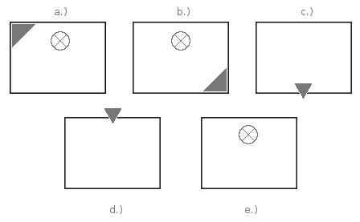
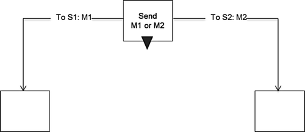
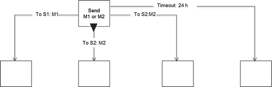
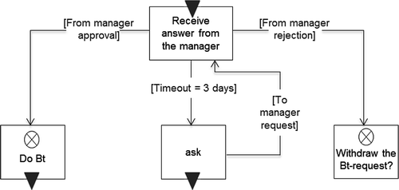
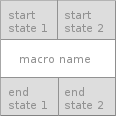

# Subject-oriented Business Process Management 

As every Business Process Management method addresses the business and the
technical aspect of an organization, so does S-BPM. Therefore it has to tackle
the business' processes for all its stakeholders, to support every employee to
fulfill his or her job [@bucher:2009]. This means that it depicts a process from the
view of every participant. As Fleischmann et al. [@fleischmann:2010] state:

> S-BPM is a role-centric and communication-centric tool for the development
> of organizations. [...] It does not put the development of functional processes
> in the foreground, but [...] the subjects and their interactions.

S-BPM heavily focuses on the people who participate in the processes. They shall be empowered to actively partake, not only in
the work which has to be done at their position, but also in the continuous
life-cycle of a process (see +@fig:s-bpm-life-cycle ).
S-BPM tries to succeed in this empowerment of employees, by providing the most
simple possible modeling language.

{#fig:s-bpm-life-cycle}

Of course, work performers are not the only employees who continuously develop
a process. Further important roles within a S-BPM process are described in chapter [S-BPM
stakeholder](#s-bpm-process).

In S-BPM a process is simply thought as consecutive actions of subjects which
communicate over messages. So it is similar to other common modeling languages
where you have basic shapes representing some entity, control flows and some form
of interaction among those entities.

But the spirit of S-BPM is to be as simple as possible and to keep ambiguities on
purpose. It does not try to enable people to model a complete or error proof scenario
of real world problems. It puts the human subject in the middle and knows about
practical flaws of humans.

If a human resource knows how to do a step in a production line, in S-BPM the common
approach is to simply tell the subject to do exactly that. Whereas in other modeling
languages you are tempted to think of every possible situation and try to handle
all of these errors. As a consequence, employees might not be able to handle unforeseen
events--- which will happen--- and do not have the authority to act accordingly. Usually
managers or admins of IT systems need to take part in a process step, where the employee
could manage the action by himself if he had the needed freedom.

So in S-BPM it is crucial to think of every process as a collection of subjects
who do stuff together. Those subjects do communicate all the time to gather or forward
information when needed. They may work on an object which will be transformed and 
finished over the course of interaction of those subjects.

As S-BPM tries to be simple and ambiguous on purpose there is only a limited and clear
set of shapes to model a process (see [Modeling constructs](#constructs)).
Subjects interact through messages, which can be a simple "ping" message,
a complex data object (see [Business Objects](#bo)) or physical assets.

## Subject, Predicate, Object

As mentioned above, one of the main ideas of S-BPM is to enable every worker to
model and improve business processes themselves. This raises the need for
a language which is easy to understand by every employee and not only well
trained business process engineers. The lowest common denominator for this
situation is the natural language. A natural sentence consists of at least a
subject, a predicate and an object.

The subjects represent workers, which can be employees or systems. They play a crucial role in the process
life-cycle. Subjects do not only execute work tasks, but are also consulted for
process development and improvement [@fleischmann:2010, p.74-117]. A predicate
represents activity bundles which the subject is able to perform. And last, the
object is the entity on which the subject works on.

The point in S-BPM is to extract a process model from a sentence expressed
in natural language. Then the process engineer identifies the important and
formalizable parts of the sentence, which will be needed to construct a
thorough model.

## The S-BPM Process {#s-bpm-process}

> An S-BPM process (short process) is defined as set of agents each of which is
> equipped with an Subject Behaviour Diagram (SBD) so that the process behavior can be defined by the
> SBD-behavior of its subjects [@fleischmann:2010, p.473]

There is a distinction between S-BPM process models and S-BPM process
instances. While the model represents the general behaviour of participating
parties and how a business transaction is managed. A process instance is
a concrete occurrence of the process described and contains data like actors,
activities, affected business objects and messages [@fleischmann:2010].

Actors are instantiated subjects. While a subject is the blueprint of a work
performer, actors or agents are real world entities, which take the role of a
subject in an ongoing process.

To better illustrate that circumstance, the ordinary legislative procedure of 
the European Union[^eu-procedure] shall be used (see +@fig:legislative). The
grey rectangular in this figure is the business object, which in this case
is the proposal. Business objects will be discussed later on.

{#fig:legislative .class width=395 height=299}

The first step of the procedure is a subject
which submits a proposal to the European Commission. In this figure a general subject called
"proposer" is able to initiate the process. In an instance of this legislative process,
an agent who is able to take the role of the "proposer" may be one of the following:

- European Central Bank
- European Investment Bank
- Civil Initiatives
- 25% of EU member states
- European Parliament.

Then the European Commission checks the formal validity of the proposal.
If positive, the commission forwards the proposal to the parliament which may adopt or amend it.
After the rehearsal of the parliament, the European Council is able to adopt or amend the parliaments
edited version. If the council accepts the proposal, it is able to be signed and therefore applicable 
law. 

S-BPM processes can be described through a SBD and
a Subject Interaction Diagram (SID). There is one SID and one SBD for every
subject. 
Those two diagrams suffice to describe a business process completely.
Both diagrams can be expressed in graphical
and tabular/textual forms as depicted in +@tbl:sbd (SBD) and +@tbl:sid (SID).

-------------------------------------------------------------------------------
Nr.   State              Predicate	           Object		                 Go
----- ------------------ --------------------  ------------------------- ------
S     receive state      accepts               proposal                  1

1     function state     rehearse/edit         proposal                  2

2     send state         sends                 proposal
-------------------------------------------------------------------------------

Table: Subject Behaviour Diagram of the European Parliament {#tbl:sbd}

----------------------------------------------------------------
Nr. Subject            Sends Message        To Subject
--- ------------------ -------------------- --------------------
1   Employee           Project Design       Manager

1   Employee           Project Design       Manager
----------------------------------------------------------------

Table: Subject Interaction Diagram of the ordinary legislative procedure of the EU {#tbl:sid}

To model a process in S-BPM there are three steps involved:

1. At first you have to evaluate the subjects in a process, which play an active part
   (see +@tbl:subjects).
2. The second step is to create the SID. 
   The SID is responsible for showing the big picture of a business process.
   It shows every subjects role in a process and when it has to interact with 
   another subject. Hence the name. It concentrates on a managers view of the
   workings of a process. For example:" When does cowoker1 need something from
   coworker2, so he can work on object1."
3. The last step is to create an SBD for every partaking subject. The SBD tells
   us everything about the inner behaviour of a subject. Its output is a
   consecutive list of send-, receive- and function-states ([see chapter Subject Behaviour](#s-behaviour)).

----------------------------------------------------
Subject                  Source
------------------------ ---------------------------
European Commission      internal

European Parliament      internal

European Council         internal

European Central Bank    internal

Civil Initiatives        external

European Investmentbank  external

25% of EU States         external
----------------------------------------------------

Table: Set-up of internal and external subjects {#tbl:subjects}

Business Process Management methods usually have a cultural aspect to it,
meaning, that the process development method is not limited to a technical and
functional point of view. In fact, it tries to implement a business culture
which is embedded into a BPM. 
In S-BPM one way of enforcing this is to specify certain roles of stakeholders,
which actively take part in the process development life-cycle. Fleischmann et al.
[@fleischmann:2010] specified four roles: 

1. A **governor** mainly is responsible for the environmental factors of
   a process. He is the interface between executive officers and the operational
   business. The governor should always have the big picture in mind when
   tackling certain problems.
2. **Actors** are the subjects as mentioned above. They run work processes and
   identify problems or weaknesses in current process models. They know best,
   how certain parts of processes actually are executed.
3. **Experts** represent specialists in specific fields, as the name indicates.
   They consult the other roles for certain recognized problems.
4. **Facilitators** are the "glue of the process environment". They usually are
   represented by project managers, coaches or members of middle management.
   Their role is to manage the communications of all roles and consult
   additional experts or actors when needed.

Those are roles which also exist in different management paradigms, but with different names.

## Modeling Constructs {#constructs}

Since S-BPM tries to be as simple as possible, there are only a few modeling
constructs which build the S-BPM modeling language. The whole modeling language
is based on the Parallel Activity Specification Schema (PASS). According to Elstermann et al. [@pass1]
"it has been effectively applied to capture the requirements for business process management in several domains", and
further it "has been proven to be well understandable and considered to be appropriate
to capture and model the essence of processes".

The graphical notation has not been standardized so far, though steps towards standardization
have been made in research by Elstermann et al. in [@pass1] and [@pass2]. The notation can also be 
downloaded as a Microsoft Visual plugin [^visio-plugin]. The shapes in this thesis
are loosely based on the aforementioned work and on Fleischmanns et al. [@fleischmann:2010].

[^visio-plugin]: At https://subjective-me.jimdo.com/visio-modelling/ you can download the
  plugin. Additionally there is a tutorial on how to use the plugin in Visio.

### Basic Shapes in S-BPM

Obviously, the subject is
the main focus of the language and is represented with a simple rectangular
shape and the subjects name (see +@fig:subject). These shapes are used to display
the communication structure in a process. The communication structure will be
further explained in the following sections. 

{#fig:subject .class width=57 height=57}

Subjects are only the logical abstraction of a work performer. If there is an
active process executed in the real world, instances of the subjects will be
created. Those subject instances are called agents. The term agent derives from
agent-based systems which are the foundation of S-BPM. Such an instance can be
an actual person, who fits the role of the described subject. In an analogy to
programming languages, the subject can be seen as a class in Java and the agent
is the instance, or an actual data-object during runtime.

In +@fig:constructs a list of every symbol which depict a subjects state of its behaviour
can be seen. The meaning is as follows:

a. The triangle in the left upper corner represents, that this state is the starting point
   for the subjects which behaviours is being modeled.
b. The triangle in the right bottom corner represents the end state of the subject.
c. A send-state.
d. A receive state.
e. A function state.

{#fig:constructs .class width=448 height=277}

### Subject Behaviour {#s-behaviour}

A subject performs different kind of actions in a specific order. This action 
sequence in a S-BPM process tells a subject what it has to do and when.
The complete description of actions of a subject is called subject behaviour.

A subject is always in one specific state which describes a subjects current
situation. Meaning that it tells what a subject is or should be doing
right now. Fleischmann et al. [@fleischmann:2010, page 196] state:

> In S-BPM, work performers are equipped with elementary tasks to model their
> work procedures: sending and receiving messages and immediate accomplishment
> of a task (function state).

In +@tbl:s-behaviour all of the three different kinds of state and their according figures
are listed. 

-----------------------------------------------------------------------------------------------
Description           Symbol
--------------------- -------------------------------------------------------------------------
Function state        {.class height=57}

Send state            {.class height=57}

Receive state         {.class height=57} 
-----------------------------------------------------------------------------------------------

: The different kinds of states of a subject {#tbl:s-behaviour}

### Communication between Subjects

As stated by Fleischmann et al. [@fleischmann:2010] in the beginning of this chapter,
S-BPM is a role-centric and communication-centric tool for the development of
organizations. Which means there are two main points of view for looking at
business processes and describing them. The subjects and equally important the
communication between them. 
Each modeling construct in the S-BPM language describes one of those aspects or
tries to enhance the understanding of them. Subjects are able to communicate
over sending messages to each other. 

In the most simple form, the communication
between two subjects can be modeled as seen in +@fig:basic-communication. 
There is also a simple control structure implemented, where the subject has the possibility --- given the correct circumstances --- to send a custom message to different subjects.
This figure already contains a control structure which gives the actor *S1*
the possibility to send either the message *M1* to *S1* or the message *M2*
to the subject *S2*.

{#fig:basic-communication .class width=500 height=217}

If we want to describe this basic model with pseudo-code, we could define each
state with the following code:

~~~{.pseudo .numberLines caption="Pseudo-code for defining a state of a subject"}
if cond1 then action1
elseif cond2 then action2
~~~

To view every state of a subject as a set of arbitrary conditions and according
actions with a simple "if-then-else"-structure, is crucial for the
understanding of Abstract State Machines (ASM). Which will be used for the technical
implementation.

Depending on the system requirements, either a synchronous or asynchronous
exchange of messages can be used. As subjects may or may not be ready to send
or receive messages at a certain time, the concept of input pools has been
established as known from many other IT systems (e.g. inter process
communication in operating systems). Every subject has its own message input
pool. 
As modern IT-infrastructures are modeled and implemented as a Service Oriented
Architecture (SOA), synchronous message exchange is too costly to maintain.
Therefore the implementation of a solely asynchronous message exchange will
suffice for this thesis.

To prevent blocking subjects, which try to send a message where no receiver is
available, timeouts can be set. Subjects may block a process, because of many
different reasons. For example the breakdown of a service or simply because the
employee is sick. This has to be kept in mind when modeling processes. When the
timeout is finished, the
subject is able to go to another predefined state. This behaviour can be seen
in +@fig:msg-timeout, where the subject goes to state two when one day has been
passed. 

{#fig:msg-timeout .class width=550 height=177}

The same concept can be used for receiving messages. If a subject waits for
a specific time in the receiving state, a different action can be taken than
the happy path. This is being exhibited in +@fig:rcv-timeout. This figure also
introduces another concept. Different paths can be chosen according to
variables in the message or business object (which is part of the message).
The variable in thise case is the approval or disapproval of a manager. 
Timeouts also can be initiated by subjects themselves. This is yet again a simple message with the variable "breakup" instead of the "timeout" path.

{#fig:rcv-timeout .class width=500 height=238}

### Behaviour Macros

Depending on the granularity of a process model --- which is modeling language
agnostic --- there may be a lot of repetitive tasks which have to be modeled
over and over again. Therefore the S-BPM language offers a simple way of
portraying reoccurring functions with behaviour macros. 

Those reoccurring functions may appear mostly within a subject, but are also able to depict
functions which span over several subjects. A behaviour macro is very similar
to a sub-process in BPMN. As the BPMN 2.0 states, a sub-process is an activity
that encapsulates a process and once it is instantiated, its elements behave as
in a normal process [^bpmn].
A macros graphic representation (see +@fig:macro) is a simple table consisting of three rows. 
Where the first row lists all possible start states (one per column) and the 
last row does the same with all possible end states. The middle row tells the 
name of the macro. A macro therefore, only shows the most important part: its interface.

{#fig:macro .class with=114 height=114}

### Business Objects {#bo}

Business Objects are structured objects which can be sent along with messages.
Each BO has a name and a specififc content and the business object itself can
be seen as the payload of each message. Fleischmann et al. [@fleischmann:2010]
defines business objects as physical and logical "things" that are required to
process business transactions. According to him they can be considered as data
structures composed of several basic data types or other such data structures.
Therefore we can also think of business objects in its simplest form as
`Structs`{.elixir} in Elixir or objects in Javascript, Java, Python or similar
concepts of programming languages. 
+@tbl:specs represents a simple BO which holds the data of an employee. It
is a well defined data structure, with no random bits of information.

--------------------------------------------------------------------------------------------
Data structure     Meaning          Data type        can/must         Value range/default
------------------ ---------------- ---------------- ---------------- ----------------------
Name               Last name        String           m                 -

First name         First name       String           m                 -

Phone number                        Integer          m                 -

Orga. unit                          String           c                 -
--------------------------------------------------------------------------------------------

: Business object specification {#tbl:specs}

Business objects are processed by subjects and they are crucial for performing
an output of business processes. They do not cease to exist when a process is
finished and can be used afterwards.

The overall structure of a BO may change during process execution. This is 
more efficient and easier to work with for the subjects. Additionally it also enables
data protection inside an organisation to fulfill compliance.

Krauthausen et al. [@krauthausen:2012] presents a different kind of view on BOs, by introducing a
"Top-Down"-approach as a starting point to identify business requirements. He
states that tasks can be described very well when you refer to the items which
should be the result of the task. These items are the BOs and are at the very
center of every action in a business process.
According to Krauthausen et al. [@krauthausen:2012] a BO is therefore a well defined entity of business activities which must be treated in a specific way.

In conclusion it is important to note, that because of the aforementioned
characteristics of a BO, every BO has its own well defined life cycle. During
its life cycle --- in an organisations boundaries --- the BO will change, but
will retains its integrity and identity. Therefore every instance of a BO has
some sort of ID and will be unique inside an organisation. 

BOs in S-BPM also support access privileges and different views on BOs. This is
done with well known read/write access entries in the BOs structure (see +@tbl:readwrite). 

---------------------------------------------------------------
Data element       View of employee View of Human Resources
------------------ ---------------- -------------------------- 
Name                       R                   R/W

First name                 R                   R/W

Phone number               R                   R/W

Orga. unit                 R                   R/W
---------------------------------------------------------------

: Business object views and access privileges {#tbl:readwrite}

Another important concept concerning BOs is the use of global and local
BOs [@fleischmann:2010, p. 209-211].

Local Business Objects

: Subjects are able to generate local business objects. Those BOs can only be
  read or modified by the generating subject itself. Other subjects can acquire
  access to this instance, if a copy has been sent to them via a message. Local
  BOs should be used for business transactions with external partners.

Global Business Objects

: A global BO is stored in a central database. Every subject of a business process
  is able to access this BO in the database. This BO is shared among every subject across a complex process network.

## Conclusions of S-BPM

S-BPM is all about subjects and the communication among them. This becomes evident
when you look at the outcome of a process model done with S-BPM. First you have the
look on the communication, the SID, and second there is an intern behaviour of every
partaking subject, which results in the SBD for every subject. Along with a list of
every important subject in a process, you are able to model every possible business
process.

Because of the intended ambiguous nature of S-BPM, it makes it possible to model
a process as detailed as it has to be, without caring about every possible 
possibility in real life scenarios.

The aforementioned outputs of the S-BPM modeling method, are fundamental to understand
the formalization process, which will be discussed in chapter **TODO**.

[^eu-procedure]: The ordinary legaslative procedure of the EU for evaluating
a statute: http://www.europarl.europa.eu/external/appendix/legislativeprocedure/europarl_ordinarylegislativeprocedure_howitworks_en.pdf;
accessed on 02.02.2018; the process has been shortened for reasons of simplicity. In real world scenarios
there are two additional rehearsals of the proposal, done by the council and the parliament.

[^bpmn]: BPMN 2.0 specification: http://www.omg.org/spec/BPMN/2.0/PDF, page
430; accessed on 25.01.2018
