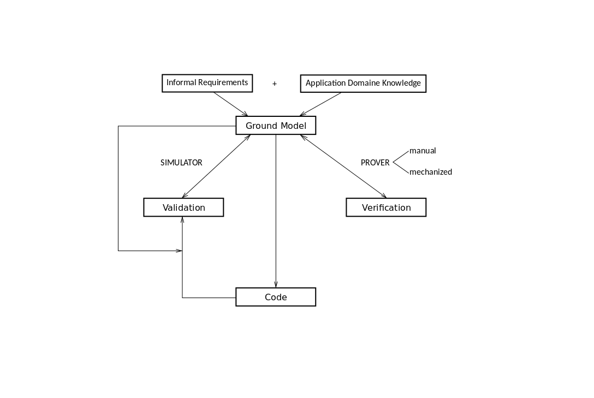

# Abstract State Machines 

This chapter will introduce the ASM method for high-level system design for
designing and implementing complex systems. The method itself has been developed
in the 1990's and successively got more attention, despite the first strong opposition.
Many scientists saw the method as "yet another form of an old fashioned low-level operational method" [@boerger:origins].
For a more detailed historical view on the topic and several practical impacts and examples see [@boerger:origins].

One example for practically using the ASM method can be seen in [@boerger:java]. In this book the ASM method is used to
provide a structured and high-level description with mathematical and an experimental analysis, of Java
and the Java Virtual Machine (JVM).
Another good practical example for using the ASM method are several standards for modeling and
programming languages. The VHSIC Hardware Description Language (VHDL) standard has been described using
ASMs, also OCAML and parts of C/C++.

The ASM method is a framework for designing hardware and software systems in a structured way.
It does so by building up a ground model, which can be seen as the "blueprint" of a system. And further
refines the ground model until it is detailed enough to be put into code. It is a method for transforming
the human understanding of a system from an application perspective, into compilable code.

The methods provides implicit documentation, which help system designers to refine their models again
when change is happening. Therefore it is also a method which helps to overcome several problems which
are tackled by change management.

As the ASM method is a complete framework for developing big systems, it not only covers formal
methods for proving the correct implementation of systems. But has also a lot to offer for typical
project management tasks like requirements analysis, documentation and distributed working.

This thesis though, will concentrate on the formal method of implementing systems with software.
In detail, it will be used to translate an intermediate representation of a business model,
into a executable program inside a virtual machine environment.

The purpose of this methodology is to guarantee a match between the users understanding of a 
business process, and the technical implementation of it, representing the correct meaning.
The ASM method helps doing exactly that. Though a one hundred percent correctness in the 
implementation, concerning the intention of the process modeler, is naturally not possible.

## The Abstract State Machines method for high-level system design and analysis

> Technically ASMs can be defined as a natural generalization of Finite State Machines (FSM) [...] by extending FSM-states to Tarski
> structures. Tarski structures, also called first-order or simply mathematical
> structures, represent truly abstract data types. Therefore, extending the
> special domains of FSM-computations to these structures turns finite state
> machines into abstract state machines [...] [@boerger:2003].

Tarski structures are simply arbitrary sets, of arbitrary elements with arbitrary functions and 
relations defined on them.
Another more informal definition, also stated by [@boerger:2003] is that basic ASMs
are "pseudo-code over abstract data".
Instead of the FSMs internal control states, which are unstructured (**TODO** what does unstructured mean?)
, ASMs use arbitrarily complex data in its states.

ASMs experienced a shift in its notion from "simultaneous parallel actions of a single agent", to a more general
definition of "multiple agents act and interact in an asynchronous manner" [@boerger:2003, pp. 28].

ASMs interpreted intuitively can be seen as a virtual machine executing pseudo-code operating on abstract data structures [@boerger:2003, Sect. 2.4]

Basically there are three stumbling blocks for a designer of software and/or
hardware engineers, when they want to develop a system:

- size,
- complexity
- and trustworthiness [@boerger:2003, p.1].

The ASM-method is suited for procedural single-agent and for asynchronous
multiple-agent distributed systems.

The method bridges the gap between a human understanding and formulation of
real-world problems and the deployment of their algorithmic solutions
(implementation as a software and/or hardware machine).

The ASM-method enables engineers to:

- Develop a *ground model*. The ground model represents a correct and complete
  human-centric task formulation. This is the result of the requirements
  captuure process. It is basically the binding contract between the
  application domain expert (usually the customer) and the system designer
- Refine the ground model. Several intermediate models constitute a *hierarchy
  of refined models*.
- Link the most detailed specification to generated code which should show that
  the model of the system is correctly solved according to the ground model
  (the contract with the customer)

There are four major benefits when using the ASM method [@lerchner]:

- Intelligibility: "The method bridges the gap between the human understanding and formulation of real-world problems and the deployment of their algorithmic solutions by code-executing machines on changing platforms." [@applied:boerger99]
- Precision: because of its mathematical foundation, the result is a precise model.
- Scalability: there exist a couple of different kinds of ASMs which have different capabilities.
  They can be distributed, synchronous or asynchronous, and/or multi-agent ASMs.
- Execution: ASM specifications are able to be verified and validated, and therefore can also be executed. 

The ASM-method lets the developer/engineer decide at any given point, which
layer of abstraction he chooses. As any machine can have a function which is
more or less powerful (which resembles the granularity of abstraction).

The most important practical benefit of the ASM-method is to provide a simple
and precise framework to communicate and document design ideas and a support for
an accurate and checkable overall understanding of complex systems.

ASM-method makes heavy use of pseudo-code. But what does it add to the long
existing method of pseudo-code development? To read and write ASMs no knowledge
of the underlying theory is needed. Though it is the mathematical underpinning
which makes the method work. The ASM-method "complete(s) the longstanding
structural programming endeavour by lifting it from particular machine or
programming notation to truly abstract programming on arbitrary structures"i [@boerger:2003].

ASM also can be understood as framework which integrates the following activities and techniques
to system development, which can be seen in +@fig:framework.
At first the ground model has to be developed using informal requirements and application domain 
knowledge. This states the functionality of the system and describes the environment of it (input
and output). Through stepwise refining and reflecting design decisions, more detailed models of the
ground model will be produced. Each of those will be verified through manual and mechanized techniques.
When the model is detailed enough to be implemented in code, the system can also be validated using
according test cases.

{#fig:framework}

The difference between validation and verification is that the former means:"Are we
building the right thing?". Whereas the latter means:"Are we building the thing right?".

So validation is the review if the process is effective and "whether its expected result is delivered
in the form of a product or service" [@fleischmann:2010]. This also corresponds to the statement of 
the ISO 9001.

## Basic ASMs

To recall, ASMs are enhanced Finite State Machines (FSM). 
As it is stated in [@pearson:automata] the formal definition of a FSM is a quintuple $M = (Q, \Sigma ,q_{0},\delta ,F)$, where:

- $M$ is the to be described automata,
- $\Sigma$ is the input alphabet (a finite non-empty set of symbols),
- $Q$ is a finite, non-empty set of states,
- $q_{0}$ is an initial state, an element of $Q$,
- $\delta$ is the state-transition function: $\delta : Q \times \Sigma \rightarrow Q$ and
- $F$ is the set of final states, a (possibly empty) subset of $Q$.

The state-transition function $\delta : Q \times \Sigma \rightarrow Q$ means, that in every state out of $Q$
with an input symbol out of $\Sigma$, the transition function assign a follow-up state. 

Beside the notation of automatas with tuples, there are also two other common notations 
which have better readability. One being a tabular representation of all concrete 
transition functions, like in +@tbl:transition . The other one is a directed graph. The latter
option will be further explained in [chapter 5](#graphs).

For better understanding of the differences between a FSM and an ASM, a simple FSM shall be used
as an example. The automata shall accept any combination of words, which contains the string
01 and its prefix and suffix may be of any combination of 0 and 1. Therefore accepting words could be
1000111, 0001111 and 01. Words which will not be accepted by the automata are $\epsilon$ (an empty word), 
111000 and 0.
Its alphabet is $\Sigma = \{0, 1\}$. The set of states is $Q = \{q_0, q_1, q_2\}$, where each state means
the following:

- $q_0$ is the state in which none symbol has been read or the automata has read a 1.
- $q_1$ is the accepting state. This means the string 01 has been read, and so the automata
  will accept any incoming symbol.
- $q_2$ is the state where a 0 has been read and the incoming symbol is a 1. This transforms
  the automatas state into the accepting state ($q_1$).

According to this we can define the transition table:

             0       1
---------- ------- -------
 $q_0$      $q_2$   $q_0$
 *$q_1$     $q_1$   $q_1$
 $q_2$      $q_2$   $q_1$

Table: Transition table for a simple FSM. {#tbl:transition}

According to this transition table we get the following transition functions:

- $\delta(q_1, 0) = \delta(q_1, 1) = q_1$
- $\delta(q_0, 1) = q_0$
- $\delta(q_0, 0) = q_2$
- $\delta(q_2, 0) = q_2$
- $\delta(q_2, 1) = q_1$

The concrete FSM of the former example can be formalized as the tuple $M = (\{q_0, q_1, q_2\}, \{0, 1\}, \delta, \{q_1\})$.
Where $\delta$ is the set of all the aforementioned transition functions.

To define an ASM $M$ one has to 

- indicate its signature,
- the set of declarations of functions and rules (with the function classification see +@fig:asmfunctions),
- the set of initial states
- and the unique main rules.

As there is not much literature on ASMs, and the ASMbook is quite limited to mathematicians, the following
definitions shall be listed to understand what each term means. They build the formal foundation and are essential
for implementing an ASM as a software.
Though the following concepts are not needed to understand an ASM in its
graphical (see control state ASM) or pseudo code representation, they certainly do help the software developer
and people who want to understand the foundation of the ASM method. The definitions are taken from [@boerger:2003]:

Signatures

: A signature behaves very much like the signature of a function in programming
  languages. It acts as a unique identifier with a function name and its arity. Where the arity must be
  a non negative integer. If the arity is $0$ the function is called a *constant*. Every ASM signature 
  contains the constants *undef*, *false* and *true*.
  Signatures therefore can be seen as the description of a function. Other ways to describe
  the functions may be axiomatic constraints, abstract specification, explicit or recursive definition 
  or by a program module.

Condition

: Also called Guards. It is a predicate logic formula which evaluates to true or false.

Location

: Is a pair of a function name $f$ and arguments $(t_i, ...., t_n)$, where $t_i$ is a term.
  In ASMs they represent the concept of basic object containers.
  In literature locations are often described as tables like in databases. In this
  "virtual table" you could look up every value, computed by the function with the
  to be looked up arguments. In +@tbl:location you can see that "virtual table",
  where the function name, are handled similar like private keys in relational databases
  and the arguments are the attributes. With this information you can lookup the value.

Function name     $a_1$        ...        $a_n$
--------------  ----------- ---------- ----------
 $f$              $v_1$        ...        $v_n$
 ...              ...          ...        ...
 $h$              $v_1$        ...        $v_n$
-------------------------------------------------
Table: The location notated as a table. {#tbl:location}

Updates

: An update is a concrete location-value pair. $f(v_i, ...., v_n) := t$.
  Therefore the update, executes a function, which means that the current state changes.
  To put it in other words, an update is a transition from one state, to another.

Functions

: Functions in the context of ASMs have the same meaning as in math. The ASM method
  classifies the function into several different kind of functions (see +@fig:asmfunctions).
  This classification helps to model systems and understand them better. It does so by defining
  which function is executed by which ASM or agent and what kind of accessibility it has.
  When defining the ground model, one needs to understand the different roles of each agent
  and what the agent is allowed to do.
  Static functions do not depend on the state of the automata and do not change over different
  runs of the ASM. Dynamc do the exact opposite and may change as the state of a machine progresses.
  Dynamic functions are further distincted into controlled, in, out and shared functions. In and 
  out functions represent a form of input and output of one machine. We also call the in functions
  monitored, which makes it obvious, that such functions are not updatable by the machine itself.
  Whereas the out functions are updated by the machine, but not read in any form.
  Similarily, controlled functions are only updatable by the machine itself, but no other machine, but
  also readable by the machine.
  And shared functions are readable and updatable by the shared functions executing machine, and other
  machines as well.

![Classification of ASM functions, relations, locations [@boerger:2003, pp. 33]](images/asm_functions.pdf){#fig:asmfunctions}

ASM states

: The properties which make an ASM abstract, are the abstract state and the abstract
  object containers (locations). The abstract state is a mathematical structure, that
  is a set of certain elements with predicates and functions to operate on them. 

ASM run

: An ASM computation step executes all updates of all transition rules, 
  which guards execute to true. Each step is atomic like known from 
  Database Management Systems (DBMS).
  The ASM run concept is the same as known as the computation from transition systems.

State space

: is the set of all possible paths which can be 
traversed in a real time run of the implemented system. It includes every
possibility inside the systems boundaries.

Basic ASMs are single-agent machines, with a finite set of transition rules of the form 

~~~{.pseudo caption="Transition rules of a basic ASM"}
if Condition then Updates
~~~

The rules of an ASM are also called its *program*.

A concept in ASM to structure the notation of ASMs are modules. They can be seen 
as modules known from programming languages (like Elixir/Erlang) or packages.
They are a simple way to ease the process of defining the ASMs. 
An ASM module consists of the *header* and the *body* which hold the declarations and 
the signatures of the modules functions. The form looks like in the following listing:

~~~{.pseudo mathescape=true}
MODULE $m$
IMPORT $m_1(id_{11},...,id_{1l_1}),...,m_k(id_k1,...,id_{kl_k})$
EXPORT $id_1,...,id_e$
SIGNATUREs
~~~

In this basic ASM we can see that the ASM module is called $m$ and it imports the functions
$id_11$ to $id_{1l_1} from the module $m1$ (accordingly it does so with functions from up to the module $m_k$).
Further the module exports its functions with the names $id_1$ to $id_e$. Only functions which are 
exported in their defining module, can be imported into other modules.
In the body of the module, the declarations of functions and rules are listed.

~~~{.pseudo caption="Simultaneous execution of rule $R$" mathescape=true}
forall x with $\phi$
  $R$
~~~

Non-determinism can be modeled by the ``choose`` construct. Where the user
of the machine can choose which rule shall be used. 

~~~{.pseudo caption="Non-determinism of a basic ASM" mathescape=true}
choose x with $\phi$
  $R$
~~~

### Example

To better illustrate what an ASM is and how it looks like, some short examples shall be given.
The first one, is an example for a simple clock. Its only task is to update the current time
on the clocks display. Therefore we can write an ASM the following way:

~~~pseudo
Clock = if DisplayTime + Delta = CurrTime then
  DisplayTime := CurrTime
~~~

In this simple example we have declared four functions:

1. ``DisplayTime``{.pseudo} is a controlled function with an arity of 0. It is controlled
   by the machine ``Clock``{.pseudo}.

2. ``+``{.pseudo} is a static function which represents the addition.

3. ``Delta``{.pseudo} is also a static function, which computes the time difference since the last step.

4. ``CurrTime``{.pseudo} is a monitored function. It is controlled by the environment of ``Clock``{.pseudo}.

Another example exhibits a slightly more complex process, a typical 
ordering process in retail. The goal of the process is, that someone
invoices all pending/placed orders.
The example was taken from [@asmbook; p.89]].

To define a ground model ASM of the ordering process, the questions
from the ground model description should suffice to elevate the problem description.
This is the requirements analysis of a given problem/system, to be modeled.

So the main goal is to invoice orders. Therefore we can say, that invoicing means to 
change the state of order from *pending* to *invoiced*. Every order has exactly one
reference to a product with a certain quantity. The status change of an order is only
valid, if the quantity in the warehouse is high enough.

The most simple ground model ASM could be the following:

~~~{.pseudo mathescape=true}
SingleOrder =
  choose Order $\in$ ORDER with state(Order) = pending and
    orderQuantity(Order) <= stockQuantity(produc(Order))
    do
	  state(Order) := invoiced
	  DeleteStock(orderQuantity(Order), product(Order))
~~~

A different strategy for making the invoices can be modeled by the following
ground model ASM. It resembles a strategy, which only invoices all order of
a certain product, or none.

~~~{.pseudo mathescape=true}
  AllOrNone = choose Product $\in$ PRODUCT
    let pending = {o | state(o) = pending, product(o) = Product}
	  Total = $\Sigma_(Order \in Pending)$ orderQuantity(Order)
	  if Total <= stockQuantity(Product) then
	    forall Order $\in$ Pending
		  state(Order) := invoiced
		  DeleteStock(Total, Product)
	  else report "stock does not suffice"
~~~

In the former examples, we didn't take into account whether orders may be cancelled,
new orders arrive during the process, the quantity in stock changes, or if executing
agents access public state concurrently or in a sequence (therefore only one agent would be sufficient).
To handle this, we can think of the order like an incoming stream of data. We constantly check
the input for new orders.

~~~{.pseudo mathescape=true}
IncomingOrders = if in = ($Prod_1, Qty_1 ... Prod_n, Qty_n$) then
  forall 1 <= i <= n let o = new (ORDER) in
    orderQuantity(o) := $Qty_i$
	product(o) := $Prod_i$
	state(o) := pending
~~~

*In* is a monitored function. It resembles the customers input to the system,
which isn't controlled by the system itself. Through this, also cancellation
of an order is possible through negative quantities.

The aforementioned ASMs consider the most general and important elements of 
ground models in ASMs: 

- the understanding of what a system's state can be, 
- local transitions which alter a global state, and
- scheduling or cuncurrency issues in the system.

## S-BPM and ASMs - two siblings

Ad the similarities of the S-BPM and ASMs method

> The method bridges the gap between the human understanding and formulation
> of real-world problems and the deployment of their algorithmic
> solutions by code-executing machines on changing platforms [@boerger:2003].

both methods share three concern:

The ground model concern

: BP are designed by Domain experts  in natural
  language, heavily supported by tables, graphics diagrams and so on. Software
  developers need to put that usually ambiduous, incomplete or inconsistent
  specification into *code* "The question is how to link "informal" requirements
  documents to necessarily formalized executable code[...] in a way to guarantee
  that the code does what the requirements describe."

The refinement concern

: 

The subject-orientation concern

: This means to make the actions of the subjects explicit. Actions in this context means
  the internal (like seen in the SBD) or the external (like seen in the SID) external.

A complete ASM model is defined as follows 
: it consists of its rules together
  with a definition of its signature and a list of all assumptions made on the
  environment. The signature is a collection of data types, which defines the
  notion of machine states.
  Also the underlying timing constraints, the data types, the class of exceptions, 
  but also the computing resources, the users, etc.

Events
: Are arbitrary conditions. An event changes the value of at least one guard/condition

Actions
: are sets of *Updates* of arbitrary memory locations, which can be paremeterized.
  The parameters are of arbitrary type.

Memory location in Finite State Machines (FSM) are the *in*, *out* and *ctl_state* variables.
In ASMs they are of arbitrary expressions of arbitrary types.

## Multi agent ASMs

Multi agent ASMs are basic ASMs in a distributed environment. In the context of ASMs
and automata theory, distributed is a synonym for asynchronous. Meaning that several agents
(in this case called machines or automaton) are able to work in an independent way and 
communicating with other agents through asynchronous messages. This means that sending and 
receiving a message, will never block an agent in its behaviour.

"When dealing with multi-agent systems we use sets of agents each executing its own ASM."

"This means that technically speaking a run of an asynchronous ASM is not a
sequence of steps of an agent, but a set of such sequences defined by the
involved agents, where steps m of an agent which depend on steps m′ of another
agent are in an order relation m before m′ or m after m′." [@fleischmann:2010]

## ASM Refinements

ASM refinement is the process of gradually transforming the ground model into 
easily understandable pseudo-code which the software engineer is able to put
into compilable code. Therefore it is the opposite of the process of abstraction.

Refinement is one of the three important parts of the ASM method, besides the ground model
and the notion of ASM itself (what an ASM actually is). 

The process of refinement is to build a more concrete version of the ground model. Theoretically
there can be infinitely many refinements of a ground model. The exit condition in this case is
a refinement, which is concrete enough, to enable an engineer to implement the ASM.
It can take several refinement steps until such a level is reached.

So when looking at the big picture of a system development phase, there will be several different
versions of the ASM (which represents the to be developed system). Each of those ASMs stands 
for a specific level of abstraction/refinement of the system as a whole.
The most abstract level must be understandable by the application domain expert, whereas the 
most refined version is the direct instruction for an engineer who implements the system.
Though every refinement of the ground model is supposed to be understandable by both roles, as it is intended to be 
the common language.

Formally we call an ASM $M$ and its refined version $M\ast$. We define states $S$ of $M$ which tranform into other states
called $S'$. States of a refined machine are called $S\ast$ and its successor states $S\ast'$ and so on.
In +@fig:refinement a scheme is depictured to illustrate the relationships of the refined automatas, its states
and transition steps. 

{#fig:refinement}

The importance of this scheme lies in its statement about data in a specific state. Data (or locations)
in a state $S$ must be the same as in $S*$. This formally declares the equivalence between the corresponding
states of differently refined machines. It is expressed with $\equiv$. 

For system development, this can be seen as a contract for the developers, to ensure valid refined
models of the initial meaning in the ground model. This is the connection between more abstract and more
refined machines.

## ASM Design

The design activities consist of three steps [@boerger:asmchar]:

- The ground model construction is a blueprint which captures the initial requirements.
- The model refinement
- Model change is a combination of the former two. 

## The ground model

The ground model fills the gap between a users understanding of BP and their technical run behaviour.

The role of a system blueprint (ground model) is to capture changing requirements.
The ground model is represented by documentation which is understandable and checkable
by both, the system designer and the domain expert [@boerger:tutorial]
In this context, understandability means that everyone speaks the same language when 
developing the ground model and reading the formulated output.
Checkability means that the documented ground model reflects the intentional working of the 
designed system. It also includes the possibility for use cases to falsify the ASM ground model

The link between requirements and current implementation (in code) must be kept
up to date, and change upon requirements change.

The ground model needs to be correct, complete and consistent. Therefore the
three typical problems of software development also occur when developing
ground models (also called the CVV-problems):

- the communication problem: a language which software designers and domain
  experts can use to understand each other
- the verification method problem: 
- the validation problem: 

"faithfully reflect changing requirements and to document their provably
correct implementation in a transparent way."

Every ground model has to have three semantical model characteristics:

- Completeness
- Consistency: possibly conflicting objectives need to resolved
- Correctness

A ground model operates on an application model and therefore has nothing to do
with the software implementation. The concentration lies on domain issues
instead of issues of notation. This implies that the ground model has to come
with a general data model, general function model and a general interface
definition, along with state based system behaviour including non-determinism
and concurrency.

A ground model has to provide some form of evidence of correctness.
A ground model has no purely mathematical definition , its purpose is to
translate a piece of "reality" to a linguistic description. 

Two main parties are involve in system engineering: Domain experts and system
designers.

## System Design generel / model checking

In Software Verification mostly two methods are used in practice, namely peer review (a static method) and
software testing (a partly dynamic method). 
Because of its static nature it is very hard to detect certain problems like erroneous concurrency or algorithmic defects .
Whereas software testing will never be able to fulfill a complete coverage of all possible paths a software system is able to take.
More importantly software testing is only able to show the presence of errors, but not there absence [@principlesmc, pp. 4].

> Any verification using model-based technique is only
> as good as the model of the system [@principlesmc, pp. 9].

Model checking is a fully automatic verification technique which helps to decide if a system complies to
a certain specification. It is a formal method, Baier et al. [@principlesmc] also describes formal methods
as "applied mathematic for modeling and analyzing ICT (Information and Communication Technology) systems". 

Model checking in its most basic approach always consists of two parts:

1. The **property specification** of a system prescribes what this system should and should not do. 
   The language to describe those property specifications is usually done in some form of
   mathematical logic (e.g. propositional logic)
2. Whereas the **model description** tells us how the system behaves. 
   This step is usually done in model description languages which are similar to C, Java or pseudo languages.

To formalize the aforementioned characteristics of model checking, it is a 
description of a system($M$), which is checked against a 
logical formula ($\phi$) [@wiki:modelchecking].
$M \models \phi$

"In terms of mathematical logic, one checks that the system description is a model of a
temporal logic formula. This explains the term 'model checking'." [@principlesmc, pp. 12]

Another purpose of model checking in system design is to evaluate erroneous
behaviour of a not yet sufficiently modeled system in the design phase.
Which is more efficient and therefore cheaper.

Because of its automated nature, model checking is able to check a system 
in all of its possible states (like "brute forcing"). This is important for debugging and developing
counter solutions by finding a path of behaviour (several steps through several
possible states of the system), which leads to malfunction.

Given the following process of a program :

~~~{.pseudo caption="An intuitively correct pseudo programm with a pitfall"}
while true do 
  if x < 1337 do 
    x = x + 1
~~~

there is no guarantee that the test of the value ``x`` is
being executed atomically along with the new assignment of ``x``.
Though an intuitive reading of the example above might not hint at
possible errors, there is a possibility though. 
After the test of ``x``, another 
process gets computational time, which overwrites the value of ``x``
to a not intended value which corrupts the system. The other process
could change ``x`` to 1338, but the test `` x < 1337`` was intended
to only change the value of ``x`` when it is below 1337.

Errors:

- Modeling error:
- Design error:
- Property error:

Not discussed:

- State space problems/ general performance limitations: Models can become
  too complex and therefore not be able to be processed by today's hardware,
  or because of limited resources. Several techniques for handling those limitations
  have been developed, but will not be discussed in this thesis.

> Model checking is an effective technique to expose potential desing errors.
> Thus,model checking can provide a significant increase in the level of 
> confidence of a system design.

## Comparison with other modeling methods

To clarify why the ASM method was chosen among the other methods for interpreting and
modeling an overview of the other languages shall be given.

There is a wide variety of modeling languages and methods for business processes. In
[@alphabetsoup] a comparison of the most common modeling languages is given. The languages
are compared by four basic views which give different kinds of informations:

1. the informational view of objects and subjects which are part of the process,
2. the functional view which gives information about the transitions --- the state --- 
   of subjects and objects,
3. the dynamic view of the process, like scheduling and triggers of actions and
4. the organizational view, which represent the actors and roles who are responsible
   for the value of the company.

According to this different kind of views, the following table for language coverage can 
be established:

---------------------------------------------------------------------------
 Language   Informational   Functional      Dynamic         Organizational
            view            view            view            view
---------- --------------- --------------- --------------- ----------------
IDEF3      								   definately

Petri Nets 								   definately

RAD        somewhat						   definately      definately

EPC        references                      definately      references

REA                         definately     definately      definately 

BPML       references                      definately      somewhat

WPDL       references

RosettaNet definately                      definately

ebXML      definately                      definately      somewhat

BPEL4WS    references                      definately      definately

OORAM      definately       somewhat       definately      somewhat

EDOC       definately       definately     definately      definately

UML2       definately       definately     definately      has the 
                                                           ingredients
--------------------------------------------------------------------------

Table: View coverage of various process modeling languages {#tbl:coverage}
