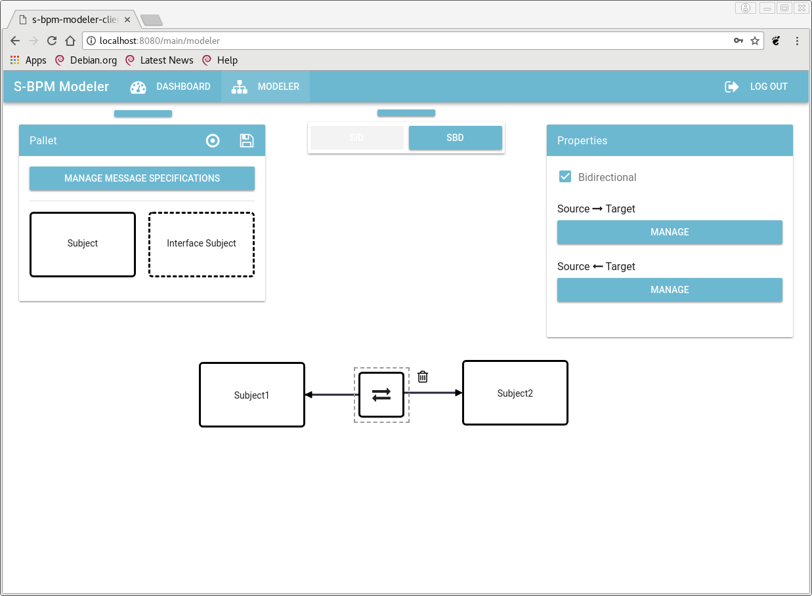
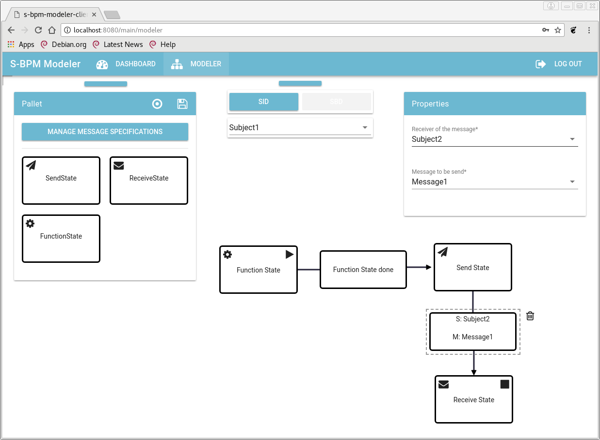

The Virtual Machine Architecture
================================================================================

The idea of a Compiler-Virtual Machine based approach of a Business Process
Execution Platform has been first proposed by Prinz [@prinz:2014 et.al.]. This
approach has been influenced by the idea of a compiler for business processes by
[@koehler:2008].The basic idea is to close the gap between a business process model
and its digitalized instance of an executable process. But [@singer:2016]
enhanced this model by proposing an actor based solution with the philosophy of
S-BPM in mind and also using S-BPM as modeling language. There are several
important reasons which should be mentioned for his decision. 

First there seems to be a large gap between theory, academic research and
practice [TODO citation needed]. Therefore a way of modeling is needed which
enables every participating employee to express his point of view into a
language which can be used to model a process. Furthermore [@singer:2016] proposes a
general purpose virtual machine for hosting processes without the need of a
heavy weight business process management system (BPMS). For the technical
implementation he chooses the Erlang/Elixir platform, as it has many concepts
concerning concurrency and processes which directly map one to one to S-BPM
modeling techniques and basics of communications between subjects. 

This thesis aims to propose a concept for implementing such a virtual machine for S-BPM processes. Also, 
it especially tries to show, how Elixir on top of the Erlang-VM is able to
support this approach. As the implementation depicts a S-BPM process also from a
technically point of view.
How elixirs concepts and features map to S-BPM will be shown in the next [chapter](#technics).

Requirements
--------------------------------------------------------------------------------

Of course the virtual machine architecture has some prerequisites to fulfill.
Those requirements are- at the same time- the goals and functionalities of business
process management of the architecture. [@prinz:2015] states the Requirements as
it is know typically in the process life cycle:

1. The process is analyzed, 
2. implemented, 
3. executed, 
4. during its life span it is being monitored and 
5. improved continuously.

He also states, that the biggest lack in todays BPMS is the execution of processes.

From Abstract Syntax Trees to Process Structure Trees
--------------------------------------------------------------------------------

To realize the aforementioned system and guarantee its overall functionality,
[@prinz:2015] proposes an architecture which consists of two main parts. A
compiler and a virtual machine, as it can be seen in +@fig:compiler-engine .

![A compiler engine overview [@prinz:2015]](images/compiler-engine.png){#fig:compiler-engine}

This figure consists of three main parts:

- An unified intermediate representation (IR),

- a verifying compiler which is able to transform the input (in the form of a
  process model) into the IR,

- a process-engine which represents the virtual machine, and is able to
  directly instantiate processes from the IR.

Though they add, that the whole system consists of four subsystems for implementing
a "general overall BPM system". The remaining fourth subsystem being an error handler,
which detects errors in process models and proposes corrections if possible.

It can questioned if the phrases "compiler" and "virtual machine" are well
fitted to describe the system. Lets first look at the compiler side. 

[@prinz:2014] et al. call the two main sides--- the IR is placed at the exact border between both sides---
the producer and consumer side. In compiler theory those terms equal to frontend and backend.

In Prinz' and Singers proposal and refinements, there is a compiler-like application which
parses, transforms and semantically analyzes the given process model. Which does
not resemble a complete and proper compiler. Though conventially, a compiler is composed of
two main phases which can be differentiated into several other phases
[see @grundlagen]: The analysis and the synthesis. While the analytical
phase(usually also known as the compiler-frontend) consists of a lexical,
syntactic and semantic analysis. The second phase (compiler-backend) consists of
an intermediate code generator a code optimizer and a final code generator. The
overall structure can be seen in +@fig:compiler 

{#fig:compiler}

This typical design, has some major disadvantages though. If you want to support
several source languages on several platforms, you would need $n * m$ ($n$ being the amount of
source languages and $m$ the amount of target architectures) compilers.
Of course, many proprietary developers do not need to apply to that circumstances, if they
choose not to, depending on their business model. But especially in Free and 
Open Source Software (FOSS) a different approach is needed. Not only for
interoperability, but also because of resources. Like software developers, who are
only experts in one specific programming language and have no expertise in CPU
architecture design and instruction sets. Or the opposite of that.
For this reason, it becomes obvious that another approach should be used. This is done
by introducing an IR of programming languages, just like stated before.

In the case of programming language that is the Abstract Syntax Tree (AST). This topic
will be handled in detail in [chapter 5](#metaprogramming). [@prinz:2014] in contrast, 
calls the analogous form in a BPM environment the Process Structure Tree.

The llvm project, uses such an architecture, for the whole llvm framework. It consists of many low 
level libraries for compiling from different languages to different architectures [@llvm]. This is
crucial for an open development process, where many developers want to implement new programming languages
on many platforms.
The whole llvm architecture consists of 3 main phases (see +@fig:3phase-compiler). 
Besides the frontend and backend, there is also a middleend which usually implements
an optimization process of the IR. For example, getting rid of redundant computations.

{#fig:retargetable-compiler}

The same concept is targeted in recent research, as there are many different modeling languages in use.

{#fig:vmarchitecture}

Frontend for the architecture
--------------------------------------------------------------------------------

A project developed at the FH Joanneum Graz, implemented a web application, which 
makes it possible to build process models with the S-BPM language.[^github-modeler] The end product of
the model is an ontology (owl file, see subsection [Ontologies](#ontology)) which represents the process.

The application enables one to have different accounts, 
each with his own storage of processes, group similar processes and import and export
processes from/to OWL files. The modeler has a SID- (see +@fig:modeler-sid-view) and SBD- (see +@fig:modeler-sbd-view)
view which can be seen in the following
screenshots:

{#fig:modeler-sid-view}

{#fig:modeler-sbd-view}

[^github-modeler]: The initial project can be cloned from this repository:
  https://github.com/stefanstaniAIM/IPPR2016 . A newer version has also been
  developed and can be accessed at: https://github.com/mkolodiy/s-bpm-modeler .
  The version used for this thesis was the latter one.

## The intermediate representation with ontologies {#ontology}

As the processes need to be shared over networks and/or organisation
boundaries, a standardized way of representing a process needs to be
established. This is not only a technical, but also a logical necessity. As
S-BPM defines that subjects can be internal or external (concerning the context
in the organisation), the semantics of those subjects and therefore the way of
how the integrate in a process, need to be expressed precisely. Further
standardized models improve interoperability between different execution
engines or other systems for process execution. 

For the compiler based virtual machine for S-BPM processes there is a need of an intermediate representation (IR)
of processes. As there are many modeling tools for business processes, each using its own format, interoperability
is a necessity.
The IR needs to be able to correctly describe the process model in an application and platform agnostic way. The
subjects, its actions, the communication among the subjects and the message types (along with the business objects),
have to be reflected in process description in such a way, that the IR depicts the intentional meaning of the process.
In 2014 [@hoever] et al. first proposed to use ontologies for that matter. 

Ontology is a term lent from philosophy, which describes the classification, relation and arrangement of everything there is.
In computer science it has been used to describe certain things and their relations in knowledge-based systems.
As [@gruber] notes precisely:

> An ontology is a specification of a conceptualization.

Where conceptualization means a simplification of something (which possibly may exist in the real world)
we are interested in. He Further states:

> This set of objects [which we are interested in],
> and the describable relationships among them, are reflected in the representational
> vocabulary with which a knowledge-based program represents knowledge. Thus, we
> can describe the ontology of a program by defining a set of representational terms. In
> such an ontology, definitions associate the names of entities in the universe of discourse
> (e.g., classes, relations, functions, or other objects) with human-readable text describing
> what the names are meant to denote, and formal axioms that constrain the
> interpretation and well-formed use of these terms.

So ontologies make it possible, to express facts about things and make logical sentences
about them. Or to put it in different words "an ontology defines terms with which to 
represent knowledge"[@gruber]. 

[@hoever] et alii used the Web Ontology Language(OWL)[^owl] as an ontology description language for S-BPM processes.
When we look at the methodology of how to create an own ontology, the purpose and understanding of this
knowledge representation becomes more clear.
There are several steps which have to be followed:

1. determine the domain and scope of the ontology,
2. consider reusing existing ontologies,
3. enumeration important terms,
4. define classes and the class hierarchy,
5. define the properties of the classes,
6. define constraints,
7. create instances [@ontmethod]

[^owl]: The recent specification for OWL can be found at: https://www.w3.org/TR/owl2-overview/ .

In accordance to the above method, [@hoever] et al. define the following terms:

- subject,
- business object,
- message,
- sending (a message),
- receiving (a mesage),
- (performing) internal actions,
- behaviour,
- exit condition,
- input pool and
- size (of input pools).

The class hierarchy with all its relations can be seen in +@fig:hierarchy. 

[Class hierarchy of the S-BPM ontology [@hoever]](images/class_hierarchy.png){#fig:hierarchy}

