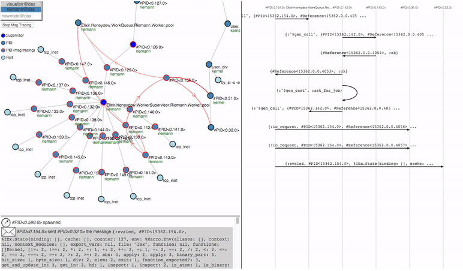

# Implementation and Technical Analysis - Elixir, Erlang, OTP and Metaprogramming

We evaluated the goals and specifications for the Compiler - Virtual Machine
architecture in the previous chapters. We further mentioned that Elixir on top
of the Erlang virtual machine is an excellent choice for the implementation.
In this chapter it will be explained how the ASM method is used to get from a ground model
to code. Therefore the theory of directed graphs will be used to transform the 
nature of a SID and SBD into an algorithm.
Further I will describe why Elixir and especially the Erlang platform
almost fit one to one to S-BPM if you compare design choices and theoretical
backgrounds. One of the most important foundations for this work, is the
concurrency model of Elixir and Erlang [^elixir].

## ASM Interpreter for S-BPM Processes

The purpose of using ASMs and S-BPM together for implementing a BP-runtime,
enables us to automatically verify and execute processes. Validating a BP
still required manual work. Based on those techniques we are able to model
a BP with a software tool and ---upon correct modeling --- instantiate a 
technical process in a runtime. 
The theoretical foundation for the following ASM-interpreter is taken from [@fleischmann:2010], [@boerger:2003], [lerchner].

## SBDs and SIDs as directed graphs {#graphs}

Mathematically speaking, SBDs and SIDs are directed graphs. This point
of view makes it easier to understand how to implement a BP in an 
algorithmic way.
According to graph theory, we can see states as nodes and each node has
possible entry- and exit-edges. Those edges lead to the next node (state).
To model and implement the transition from one node to another, we bind guards
or conditions to the entry- and exit-edges. 
Therefore every node has a set of edges and functions which select one of the
edges as entry or exit. +@fig:node depicts a single node

{#fig:node}

elixir processes don't share anything with other processes when being executed. 
Supervisors are the common way to handle errors and execution problems,
by restarting them, instead of handling every exception.
Therefore it is important to define a clean initialization function and,
when restarting a process, bring the crashed process into its last working
state. As processes are the way to keep state in elixir applications, yet 
another process will be used for state tracking of the processes.

This behaviour leads to a certain design decision for elixir applications,
and the S-BPM virtual machine, which enables and improves the fault tolerance
of such a system.
While there needs to be one centralized instance which keeps track of the state
of every S-BPM-process, executing subjects (also an elixir process) may be running
on any available Erlang node in the network. Again, this network may span over company
boundaries.
The advantage of this architecture is that a subject or even a whole S-BPM-process supervisor
is able to crash as long as the state process is being kept intact.

The elixir project visualixir[^visualixir] , is able to give a complete overview of every process
and beam node of an application. There is also a feature to trace all messages sent by
processes. Therefore it is a good debugging tool for S-BPM processes executed
in the process VM.

[^visualixir]: See https://github.com/koudelka/visualixir for further documentation.

## Elixir, a modern functional programming language

From the developers website, Elixir is:

> [...] a dynamic, functional language designed for building scalable and
> maintainable applications. Elixir leverages the Erlang VM, known for running
> low-latency, distributed and fault-tolerant systems, while also being
> successfully used in web development and the embedded software
> domain.[^elixir-def]

Elixir is very similar to Erlang and Erlang function can be directly called in Elixir source code. But Elixirs take on the Erlang VM is to provide a modern language which has a great tool support needed in modern software development.
It provides a tool-set for package management, testing and documentation.
Elixir even makes documentation a first class feature of the language itself. This means that providing documentation inside Elixirs modules, can be tested if the documentation itself is accurate. 
The following code snippet shows how to provide documentation tests. The mix tool will extract the code written after **"iex>"** and compares it to the next line `:hello_world`{.elixir}, which is the return value of the function `hello_world`{.elixir}

~~~{.elixir .numberLines caption="The mix tool will test the given example code from the @doc module attribute."}
defmodule DocPresentation do
  @moduledoc """
  # DocPrensentation
  This Modules shall be a representation on how to use 
  documentation in Elixir. You can test given code examples
  provided in documentation. This makes it possible to always
  have a working and up-to-date documentation.
  """

  @doc """
  The hello_world function provides a simple function which
  writes "Hello World!".

  # Example
    iex>hello_world()
    :hello_world
  """
  def hello_world do
    :hello_world
  end
end
~~~

This way, it is pretty easy to keep your documentation up-to-date and always provide examples for developers at the same time.

The mix tool, also supports easy and fast creation of projects. You can run tasks such as test and building escripts, which are directly executable Elixir applications.

As the introduction already said, Elixirs main focus is to write distributed and scalable applications.
Distributed in this context means, that applications are able to take advantage of as many CPU cores as possible, which can even span over the network and are not limited to a single machine. 
Scalability is guaranteed by using Elixir processes as the main building block and paradigm in writing Elixir applications. Those processes can than be distributed to all accessible machines and CPU cores. 
There is no extra implementation needed for scalability and distributed services, as it is an inherent programming paradigm. This topic is discussed in [Elixirs concurrency model](#concurrency)

- tooling
- mix projects
- Elixir is all about extensibility

Elixirs concurrency model {#concurrency}
--------------------------------------------------------------------------------

Elixirs concurrency model is actor-based. This means that Elixirs thinks of its
processes the same, as S-BPM of its subject. Every Elixir process is independent
of the rest of the application. It doesn't share any state or other memory with
other processes or applications. 
A process in Elixir is basically a self-contained sequential program which runs on its own. It is completely isolated in terms of scheduling and memory access. In Elixir, a process in implemented in the language. It is not an operating system (OS) process or thread. It is entirely handled by the erlang virtual machine, which always consists of only one OS process.
This way the Erlang VM doesn't need to add OS thread specific overhead to a process and is very lightweight in comparison.
In comparison, object oriented programming (OOP) languages use objects as their main way of modeling and implementing software. And hierarchies of said objects explain the relation of them. 

So a process in Elixir is more than just a way of how to model concurrency. It is the main paradigm on how to build the software and keep state. 

Nodes/Distributed applications

Metaprogramming
--------------------------------------------------------------------------------

Metaprogramming can be simply described as code which writes code [@mccord:2015].
This can be best explained with a short Unix shell script as an example: 

~~~{.bash .numberLines caption="Metaprogram as a Unix shell script"}
    #!/bin/bash
    echo "#!/bin/bash" > program
    for I in $(seq 1337)
    do
      echo "echo $I" >> program
    done
~~~

Definitely this program is not very useful nor does it have a real purpose. But
it is well suited to explain what code writing code means. In this example we
write a bash script, which produces an additional bash script, which represents
the program we want to implement. In this case the metaprogram therefore writes
a script, which will print the numbers from 1 to 1337. It consists exactly of
1338 lines (the first being the typical unix imperative to use bash as shell interpreteer). The result looks like follows:

~~~{.bash caption="\"Compiled\" Unix shell script"}
#!/bin/bash
    echo 1 
    echo 2 
    echo 3 
    [...]
    echo 1337 
~~~

Most programming languages represent the source code internally with an Abstract
Syntax Tree (AST)[^ast]. Jones[-@jones:2003] gives a precise definition of the AST:

> An abstract syntax tree captures the essential structure of the input in
> a tree form, while omitting unnecessary syntactic details. ASTs can be
> distinguished from concrete syntax trees by their omission of tree nodes to
> represent punctuation marks such as semi-colons to terminate statements or
> commas to separate function arguments. ASTs also omit tree nodes that represent
> unary productions in the grammar. Such information is directly represented in
> ASTs by the structure of the tree. ASTs can be created with hand-written parsers
> or by code produced by parser generators. ASTs are generally created
> bottom-up.

An Elixir program can be represented in Elixir's own data structures (e.g.
maps, list, tuples etc.). Therefore it's rather simple to manipulate the
program directly. To transform an Elixir expression into an AST, the key word
`quote`{.elixir language=Elixir} is used (hence the term "quoted expression").
This key word transforms the expression into an Elixir data structure (a tuple)
which can be seen as a textual representation of a tree. The following Elixir
code will explain this further:

~~~{.elixir .numberLines language=Elixir caption="Quoting expressions which directly act on the AST"}
    quote do: 2 + 3
~~~

The return value of this statement is:

~~~{.elixir .numberLines language=Elixir caption="Elixirs way of representing the AST"}
    {:+, [context: Elixir, import: Kernel], [2, 3]}
~~~

As mentioned above, this data structure is a tuple with three elements. The
elements are as follows:

- `:+`{.elixir language=Elixir}: Is the operator which will be used to compute
  both its arguments.
- `[context: Elixir, import: Kernel]`{.elixir language=Elixir}: is itself
  a keyword list with two values. Those values represent metadata for the whole
  expression.
- `[2, 3]`{.elixir language=Elixir}: this is again, a list with two values.
  They represent the arguments which will be handed to the operator.

To be precise, the first value of the three value tuple is not an operator, but
a function which can be found in the `Kernel`{.elixir} module. The
`Kernel`{.elixir} module is the basic module for Elixir which provides the
default macros and functions Elixir imports into the environment
[^source-elixir].

***TODO:*** add AST as graphic with expressions,

~~~{.elixir .numberLines language=Elixir caption="A more complex statement being quoted"}
quote do: if (2 + 3 == 5), do: IO.puts("2 + 3 = 5")
~~~

~~~{.elixir .numberLines language=Elixir caption="The representation of the AST of a more complex statement"}
{:if, [context: Elixir, import: Kernel],
  [
    {:==, [context: Elixir, import: Kernel],
      [{:+, [context: Elixir, import: Kernel], [2, 3]}, 5]},
    [
      do: {{:., [], [{:__aliases__, [alias: false], [:IO]}, :puts]}, [],
      ["2 + 3 = 5"]}
    ]
 ]
}
~~~
***TODO***: add concrete syntax tree as example with a more complex statement, also as a graphic

Elixirs macros work differently than for example C/C++ macros, which work with
pure text. Elixir macros on the other hand work on ASTs.

- Metaprogramming
- generative programming
- multistage rogramming

Mathematical calculi for modeling complex systems
--------------------------------------------------------------------------------

There have been different standards for modeling business processes, like the
BPMN. But they showed that there is still a large gap between the business
modeling and definition method and the technical implementation. While the
first is a very abstract understanding of processes, the latter must be
a detailed fine-grained execution behaviour of software systems
[@boerger-fleischmann:2015].

It must be ensued that the code does, what the requirements - which may be in the form of informal documents- describe.

Communication problem

: Definition 1

Verification problem

: Definition 2

Validation problem

: Definition 4

### Abstract State Machines

[^source-elixir]: Kernel source: <https://github.com/elixir-lang/elixir/blob/master/lib/elixir/lib/kernel.ex>, accessed on 16.08.2017.

[^ast]: Elixir calls Abstract Syntax Trees *"quoted expressions"*. I will
continue to use the term Abstract Syntax Tree, as it is the general term in
academic research.

[^elixir]: In the ongoing text, the term Elixir will be used for
simplification.When *Elixir* is used, this will include Elixir as the
programming language, the Erlang virtual machine as a platform and the Open
Telecom Platform (OTP).

[^elixir-def]: https://elixir-lang.org, accessed on 16.08.2017

[^macros]: transform source code to according code. Making it way more powerful
than textual macros. p56. For example: `if`{.elixir} and `unless`{.elixir} tokens are not part of
the Elixir language construct, but rather implemented with Elixir macros. Macros
are transformed at compile time. 
